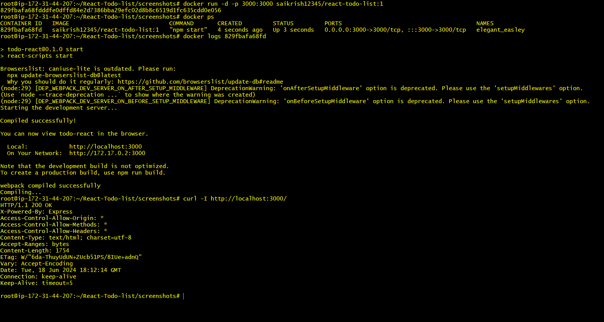
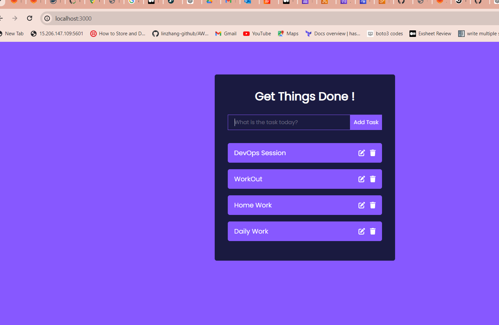
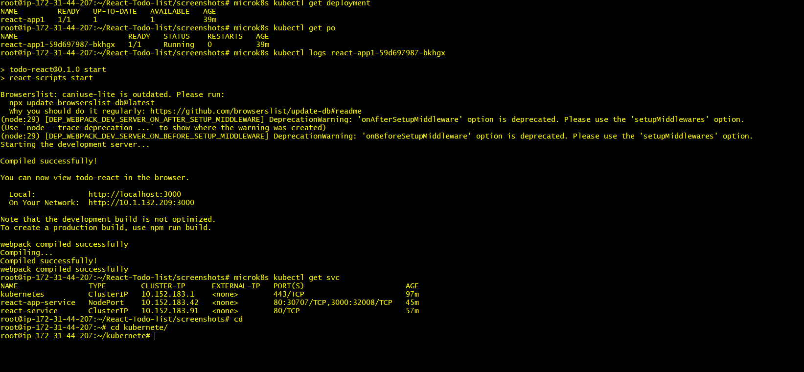
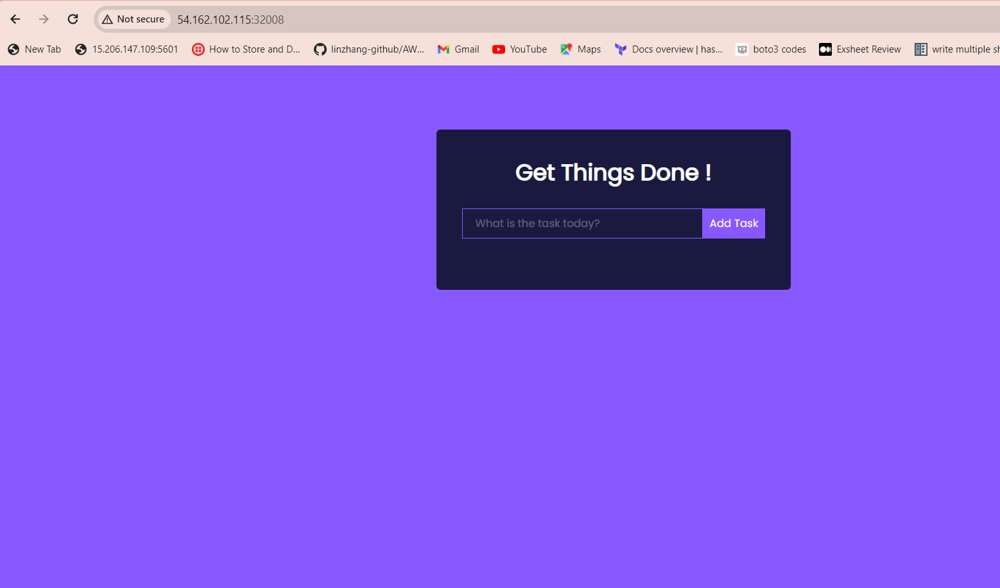

# React-Todo-list

This is a React Application to deployed on Docker and Microk8s Technologies.

 
 ## Tech Stack

  `React` `HTML` `CSS` `Javascript` `Docker` `Microk8s` `AWS EC2` `Local Laptop`

 ## How to deploy React Application
 
  - Install Docker and Microk8s
  - Get the Code from GitHub
  - Write Dockerfile
  - Build the Docker Image
  - Run the Docker Images
  - Check the Hosted API in Local using curl and check the App in Browser
  - Push the docker image to DockerHub(Opensource) for deploying on top of k8s.
  - Write the kubernetes Yaml( Manifest) files
  - Make ensure that Microk8s is in running state.
  - deploy and Apply the Yaml files.
  - Check the pods and ensure that they are in running State.
  - Check the Service of the Deployment(whether it is Nodeport or not).
  - enable microk8s enable metallb to access the App Outside of Microk8s cluster such as on Browser.
  - Take the Node IP or Localhost,Nodeport of React App and access it on Browser(http://localhost:<NodePort> or http://node_IP:<NodePort>)

## Commands and Screenshots:

**Build Docker Image**

``` 
docker build -t react-todo-list:1 .
```

**Run Docker Image**

```
docker run -d -p 3000:3000 --name react-app react-todo-list:1
```

**Check the container Logs**

```
docker logs react-app
```



**Check it out the react app running on Browser**

```
http://localhost:3000/
```



**Push Docker Image to DockerHub**

```
docker tag localimage:tag hostrepoName:tag
docker push hostrepoName:tag
```

**check whether the Microk8s running or not**

```
microk8s status
 ```

**Write Manifest files(Yaml file)**

**Deploy the App using Manifest files and troubleshoot it if any errors**

```
micrik8s kubectl apply -f deployment.yml
microk8s kubectl kubectl get pods -n namespace
microk8s kubectl get deployment -n namespace
microk8s kubectl get service -n namespace
microk8s kubectl logs <Pod_ID> -n namespace
microk8s kubectl describe pod <Pod_ID> -n namespace
```



**Test the Application outside browser, for this i used the nodeport to access the app from outsidecluster**
```
http://Node_IP:NodePort/  or
http://localhost:NodePort/
```



**Add Tasks to the Application**


